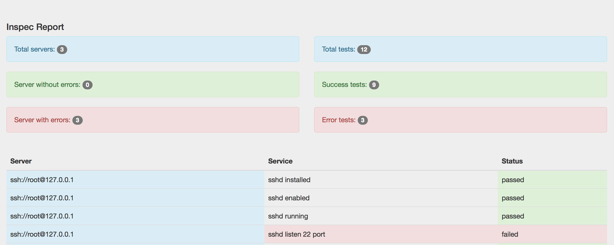

# inspec-webui

## Description

Inspec WebUI it is Rails app for show result from Inspec

## Environment

* OS: CentOS 7
* Ruby: 2.3.3
* Rails: 5.0.0.1

## Screenshots



### Prepare environment

```
# git clone https://github.com/mr-exz/inspec-webui.git
# cd inspec-webui
```

### Create VM

```
# cd ./vagrant/
# vagrant up
```

### Login to VM

```
# vagrant ssh
```

### Install gems

```
sudo -s
cd /opt/inspec-webui
gem install bundle
bundle install -V

```

### Start app

```
./bin/rails server -b 0.0.0.0 -p 80
```

## How to use

Open http://ip/ and upload Inspec script file and upload server list file.

* inspec_ssh.rb - example inspec scrip
* servers_list.csv - example servers list file

### You can finde example file in example folder:

```
# ls inspec-webui/example/
inspec_ssh.rb		servers_list.csv
```

### Upload Server list file

Example server list format: %CONNECTION_STRING%,%PASSWORD%

```
ssh://root@127.0.0.1,123456
ssh://root@127.0.0.1,123456
```

### Upload Inspec script file 

```
# encoding: utf-8
# copyright: 2016, Nikolay Ilinov
# license: All rights reserved

title 'sshd checks'

control "sshd installed" do
  describe service('sshd') do
    it { should be_installed }
  end
end

control "sshd enabled" do
  describe service('sshd') do
    it { should be_enabled }
  end
end

control "sshd running" do
  describe service('sshd') do
    it { should be_running }
  end
end
```

### Push button start

if you add a lot of servers, it will be long work.

